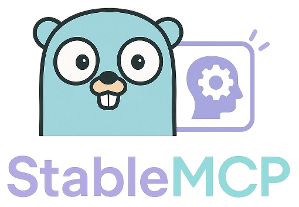

# StableMCP



A Model Context Protocol (MCP) server for generating images using Stable Diffusion.

- [StableMCP](#stablemcp)
  - [Features](#features)
  - [Project Structure](#project-structure)
  - [Prerequisites](#prerequisites)
  - [Getting Started](#getting-started)
  - [Configuration](#configuration)
    - [Configuration Options](#configuration-options)
    - [Using a Custom Configuration File](#using-a-custom-configuration-file)
  - [API Usage](#api-usage)
    - [Generate an Image](#generate-an-image)
  - [Development](#development)
    - [Testing](#testing)
    - [Version Management](#version-management)
    - [CI/CD with GitHub Actions](#cicd-with-github-actions)
  - [License](#license)


## Features

- JSON-RPC 2.0 based Model Context Protocol (MCP) implementation
- MCP-compliant API endpoint for image generation
- Integration with Stable Diffusion image generation models
- Support for various image parameters (size, style, prompt)
- API key authentication (optional)
- Configurable image size and quality settings
- Rate limiting and request validation
- Extensible capabilities system for adding new tools

## Project Structure

```
.
├── api           # API definitions, routes, and documentation
├── bin           # Build artifacts
├── cmd           # Application entrypoints
├── configs       # Configuration files
├── examples      # Example usages
├── internal      # Private application code
│   ├── config    # Configuration handling
│   ├── models    # Data models
│   └── helpers   # Helper functions
├── pkg           # Public packages
│   ├── auth      # Authentication/authorization
│   ├── handlers  # Request handlers
│   ├── mcp       # MCP protocol implementation
│   │   ├── server.go   # Server implementation
│   │   └── types.go    # Protocol type definitions
│   └── stablediffusion # Stable Diffusion client
└── scripts       # Utility scripts
```

## Prerequisites

- Go 1.22 or higher
- A running Stable Diffusion API (local or remote)

## Getting Started

```bash
# Clone the repository
git clone https://github.com/yourusername/stablemcp.git
cd stablemcp

# Create a default configuration file
make config

# Build the server
make build

# Run with default config
make run

# Run with a custom config
make run-config
```

Alternatively, you can use Go commands directly:

```bash
# Build the server
go build -o bin/stablemcp ./main.go

# Run with default config
./bin/stablemcp server

# Run with a custom config
./bin/stablemcp server --config configs/.stablemcp.yaml
```

## Configuration

StableMCP provides a flexible configuration system powered by [Viper](https://github.com/spf13/viper). You can configure the application through multiple sources, which are applied in the following order of precedence (highest to lowest):

1. **Command line flags** (highest priority)
2. **Environment variables** with `STABLEMCP_` prefix
3. **Configuration file** specified with `--config` flag
4. **Standard configuration files** named `.stablemcp.yaml` or `.stablemcp.json`:
   - `./configs/.stablemcp.yaml` (project directory)
   - `$HOME/.config/.stablemcp.yaml` (user home directory)
   - `/etc/.stablemcp.yaml` (system-wide)
5. **Default values** (lowest priority)

### Command Line Flags

StableMCP supports these global command line flags:

```
Global Flags:
  -c, --config string     Path to the configuration file
  -d, --debug             Enable debug mode (default: false)
  -h, --help              Help for stablemcp
  -l, --log-level string  Set the logging level: debug, info, warn, error (default: "info")
  -o, --output string     Output format: json, text (default: "json")
      --timeout string    Request timeout duration (default: "30s")
```

Server-specific flags:

```
Server Flags:
      --host string       Server host address (default: "localhost")
      --port int          Server port (default: 8080)
```

### Environment Variables

All configuration options can be set using environment variables with the `STABLEMCP_` prefix:

```bash
# Examples
export STABLEMCP_DEBUG=true
export STABLEMCP_LOG_LEVEL=debug
export STABLEMCP_SERVER_PORT=9000
export STABLEMCP_SERVER_HOST=0.0.0.0
```

### Configuration File Options

You can customize the application by setting the following options in your YAML configuration file:

```yaml
server:
  host: "localhost"                    # Server host address (default: "localhost")
  port: 8080                           # Server port (default: 8080)
  tls:
    enabled: false                     # Enable/disable TLS (default: false)
    # There are no default values for the following options, so these must be set if TLS is enabled
    cert: "/path/to/cert.pem"          # TLS certificate path (default: "")
    key: "/path/to/key.pem"            # TLS key path (default: "")

logging:
  level: "info"                        # Log level: debug, info, warn, error (default: "info")
  format: "json"                       # Log format: json, text (default: "json")

debug: false                           # Enable debug mode (default: false)
timeout: "30s"                         # Request timeout (default: "30s")

telemetry:
  metrics:
    enabled: false                     # Enable metrics collection (default: false)
    port: 9090                         # Metrics server port (default: 9090)
    path: "/metrics"                   # Metrics endpoint path (default: "/metrics")
  tracing:
    enabled: false                     # Enable distributed tracing (default: false)
    port: 9091                         # Tracing server port (default: 9091)
    path: "/traces"                    # Tracing endpoint path (default: "/traces")

# OpenAI configuration
openai:
  apiKey: "your-openai-api-key"        # OpenAI API key for API calls (default: "")
  model: "gpt-3.5-turbo"               # Model to use (default: "gpt-3.5-turbo")
  baseUrl: "https://api.openai.com/v1" # Base URL for API calls

# download path for generated images
downloadPath: "~/Downloads"            # Path where generated images will be saved (default: "~/Downloads")
```

### Using a Custom Configuration File

You can specify a custom configuration file when running the server:

```bash
./bin/stablemcp server --config path/to/your/config.yaml
```

Or create one of these standard configuration files:

```bash
# In your project directory
touch configs/.stablemcp.yaml

# In your home directory
touch ~/.config/.stablemcp.yaml

# System-wide (requires sudo)
sudo touch /etc/.stablemcp.yaml
```

### Configuration Precedence Examples

StableMCP applies configuration values in order of precedence. For example:

1. If you set `--log-level=debug` on the command line, it will override the log level in any config file
2. If you set `STABLEMCP_SERVER_PORT=9000` in the environment, it will be used unless overridden by a command line flag
3. If you have `server.port: 8000` in your config file, it will be used unless overridden by an environment variable or command line flag

## MCP Implementation

StableMCP implements the [Model Context Protocol](https://github.com/llm-protocol/model-context-protocol) (MCP), a standard JSON-RPC 2.0 based protocol for LLM-based tools and services. The implementation consists of:

### Core Components

- **JSONRPCRequest/Response**: Standard JSON-RPC 2.0 request and response structures
- **MCPServer**: Server implementation with name, version, and capabilities
- **Capabilities**: Extensible system for registering tools the server supports

### Server Initialization

```go
// Create a new MCP server with auto-version from the version package
server := mcp.NewMCPServer("StableMCP")

// Or create with a custom version
// server := mcp.NewMCPServerWithVersion("StableMCP", "0.1.1")

// Register capabilities/tools
server.Capabilities.Tools["stable-diffusion"] = map[string]interface{}{
    "version": "1.0",
    "models": []string{"sd-turbo", "sdxl"},
}
```

## API Usage

### Generate an Image

```bash
curl -X POST http://localhost:8080/v1/generate \
  -H "Content-Type: application/json" \
  -d '{
    "prompt": "a photo of a cat in space",
    "width": 512,
    "height": 512,
    "num_inference_steps": 50
  }'
```

### MCP Initialize Request

```bash
curl -X POST http://localhost:8080/mcp \
  -H "Content-Type: application/json" \
  -d '{
    "jsonrpc": "2.0",
    "id": "1",
    "method": "initialize",
    "params": {}
  }'
```

## Development

[](https://github.com/mkm29/stablemcp/actions/workflows/ci.yml)
[](https://github.com/mkm29/stablemcp/actions/workflows/release.yml)
[](https://github.com/mkm29/stablemcp/actions/workflows/security.yml)

The project includes a Makefile with common development tasks:

```bash
# Run all tests
make test

# Run a specific test
make test-one TEST=TestConfigLoading

# Format code
make fmt

# Run linter
make lint

# Clean build artifacts
make clean

# Check version information
make version

# See all available commands
make help
```

### Testing

StableMCP includes a comprehensive suite of unit tests covering core functionality. The key areas covered by tests include:

**MCP Server Implementation**
- Server creation and initialization
- JSON-RPC request handling
- Capabilities registration
- Protocol method handling

**Configuration System**
- Default configuration values
- Loading from files
- Environment variable integration
- Command-line flag overrides
- Error handling for invalid configurations

**Helper Functions**
- JSON formatting and transformation
- Pretty printing for debugging

**Types and Serialization**
- JSON-RPC request/response marshaling
- MCP protocol type validation
- Error handling for serialization

Run the test suite with:

```bash
# Run all tests
go test ./...

# Run tests with verbose output
go test -v ./...

# Run tests for a specific package
go test -v ./pkg/mcp/...

# Run a specific test
go test -v ./pkg/mcp -run TestHandleRequest
```

Tests use the standard Go testing library with [stretchr/testify](https://github.com/stretchr/testify) for assertions and mocking.

### Version Management

StableMCP follows semantic versioning and provides version information through the `version` package:

```go
import "github.com/mkm29/stablemcp/internal/version"

// Get the current version
fmt.Println("StableMCP version:", version.Version)

// Get all version info
versionInfo := version.Info()
fmt.Printf("Version: %s\nCommit: %s\nBuild Date: %s\n", 
    versionInfo["version"], versionInfo["gitCommit"], versionInfo["buildDate"])
```

Version information is embedded during build time using the following variables:
- `Version`: The current version from git tags or default (0.1.1)
- `BuildDate`: The build date in ISO 8601 format
- `GitCommit`: The git commit hash
- `GitBranch`: The git branch name

You can check the version of a built binary with:

```bash
# JSON output (default)
./bin/stablemcp version

# Text output
./bin/stablemcp --output text version
# or
./bin/stablemcp -o text version
```

Alternatively, you can use Go commands directly:

```bash
# Run tests
go test ./...

# Format code
go fmt ./...

# Run linter
golangci-lint run
```

## CI/CD with GitHub Actions

This project uses GitHub Actions for continuous integration and delivery:

### Workflows

- **CI**: Triggered on pushes to `main` and `develop` branches and pull requests.
  - Runs linting
  - Runs tests with coverage reporting
  - Builds binaries for multiple platforms (Linux, macOS, Windows)

- **Release**: Triggered when a new tag is pushed.
  - Creates a GitHub release with binaries for all platforms
  - Publishes Docker images to GitHub Container Registry
  - Publishes to Homebrew tap (if configured)

- **Security Scan**: Runs weekly and can be triggered manually.
  - Runs `govulncheck` to check for vulnerabilities in dependencies
  - Runs `gosec` for Go security checks
  - Runs `nancy` for dependency vulnerability scanning
  - Runs `trivy` for comprehensive vulnerability scanning
  - Reports results to GitHub Security tab

- **Issue & PR Labeler**: Automatically adds labels to issues and PRs.
  - Labels based on title and content
  - Labels PRs based on modified files

### Creating a Release

To create a new release:

```bash
# Tag a new version
git tag -a v0.1.2 -m "Release v0.1.2"

# Push the tag
git push origin v0.1.2
```

The release workflow will automatically build and publish the release.

## License

[MIT License](LICENSE)